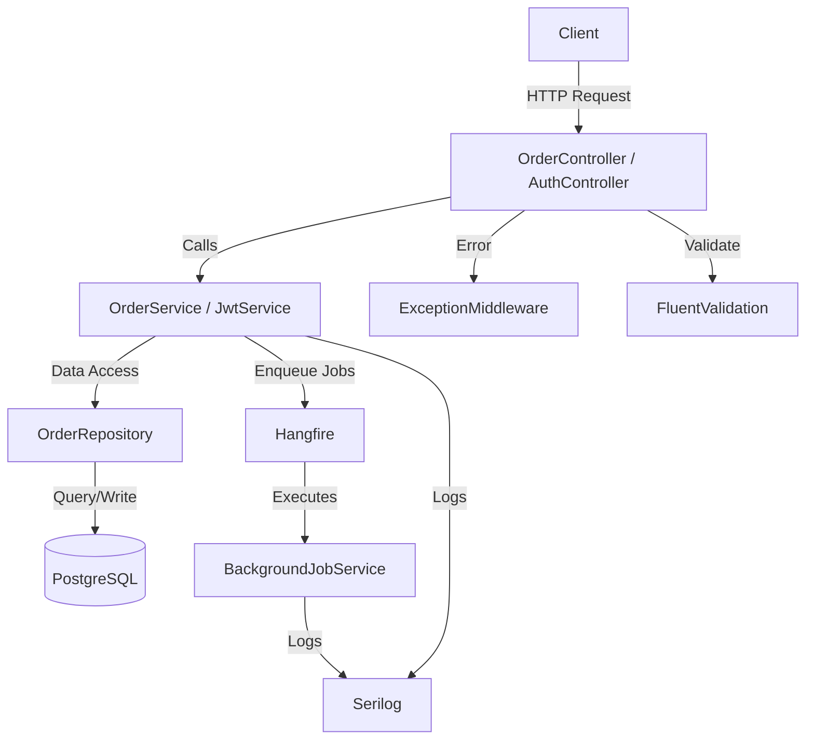

# Order Management Service


 
## Overview
A scalable Order Management backend built with ASP.NET Core (.NET 8), PostgreSQL, and Docker, featuring JWT authentication, background job processing with Hangfire, and CI/CD deployment to AWS.

Designed with scalability, maintainability, and production-readiness in mind.

> 🌐 Live: http://13.250.16.236/swagger ⚠️ Instance may be stopped to manage costs

---

## Architecture


---

## Tech Stack

| Layer | Technology |
|-------|-----------|
| Backend | ASP.NET Core Web API (.NET 8) |
| Database | PostgreSQL 15 |
| Auth | JWT + Refresh Token Rotation |
| Background Jobs | Hangfire (PostgreSQL storage) |
| Logging | Serilog (structured, rolling file) |
| Containerization | Docker + Docker Compose |
| CI/CD | GitHub Actions → Docker Hub |
| Cloud | AWS EC2 (Ubuntu 24.04, ap-southeast-1) |

---

### Core Features
- Clean Architecture (Controller → Service → Repository)
- JWT Authentication with Role-based access
- Background Jobs using Hangfire
- Refresh Token Rotation
- Environment Secret Management

### Performance & Scalability
- Priority Queue (O(log n)) for order processing
- Pagination, filtering, and sorting

### Observability & Reliability
- Global exception handling
- Structured logging with Serilog

### DevOps & Deployment
- Docker multi-stage builds
- CI/CD with GitHub Actions
- AWS EC2 deployment

---

## Business Rules

| Rule | Behaviour |
|------|-----------|
| VIP Customer | Auto-assigned `Priority` status on creation |
| Amount > 10,000 | Auto-assigned `Approved` status on creation |
| Completed orders | Cannot be updated — throws exception |
| Order Statuses | `Created` → `Approved` / `Priority` → `Completed` / `Cancelled` |

---

## DSA — Algorithmic Decision
Used a priority queue to optimize order processing:

- VIP customers prioritized first
- Higher order amounts processed next
- FIFO for equal priority

Time Complexity: O(log n) for insertion and retrieval

**Why Priority Queue?** O(log n) insertion and extraction vs O(n) list scanning — scales efficiently as order volume grows.

---

## API Endpoints

| Method | Endpoint | Description | Auth |
|--------|----------|-------------|------|
| POST | `/api/v1/auth/login` | Authenticate user | Public |
| POST | `/api/v1/auth/refresh` | Refresh access token | Public |
| POST | `/api/v1/Order` | Create order | Admin, User |
| GET | `/api/v1/Order` | Get all orders (paginated) | Admin, User |
| GET | `/api/v1/Order/{id}` | Get order by ID | Admin, User |
| GET | `/api/v1/Order/next-for-processing` | Get next priority order | Admin |
| PUT | `/api/v1/Order/{id}` | Update order | Admin |
| DELETE | `/api/v1/Order/{id}` | Delete order | Admin |

---

## Project Structure

OrderManagementService/
├── Controllers/          # API Layer: Handles HTTP requests & routing
├── Services/             # Application Layer: Business logic, DSA (Priority Queue), & Hangfire jobs
├── Repositories/         # Infrastructure Layer: Data access abstraction (Repository Pattern)
├── Domain/               # Core Layer: Domain entities and Enums (Status codes)
├── DTOs/                 # Data Transfer Objects: Request/Response contracts
├── Middleware/           # Cross-cutting concerns: Global exception handling & logging
├── Validators/           # Data Integrity: FluentValidation rules
├── Data/                 # Persistence: EF Core DbContext & Migrations
├── Dockerfile            # Containerization configuration
└── .github/workflows/    # CI/CD: Automated build/test/deploy pipeline

---

## Getting Started

### Prerequisites
- .NET 8 SDK
- Docker & Docker Compose

### Run with Docker (Recommended)
```bash
docker compose up --build
```

### Run without Docker
```bash
# 1. Configure appsettings.json with your PostgreSQL connection string
# 2. Apply migrations
dotnet ef database update
# 3. Start
dotnet run
```

### Access

| Service | Local | AWS Live |
|---------|-------|----------|
| Swagger UI | http://localhost:8080/swagger | http://13.250.16.236/swagger |
| Hangfire Dashboard | http://localhost:8080/hangfire | http://13.250.16.236/hangfire |

---

## How to Test API

Use Swagger UI to test the API:

- Login to obtain JWT token
- Use token for authenticated endpoints
- Test order creation and priority processing
---

## Environment Variables
```env
ConnectionStrings__DefaultConnection=Host=db;Port=5432;Database=ordersdb;Username=postgres;Password=postgres
ASPNETCORE_ENVIRONMENT=Development
JwtSettings__SecretKey
JwtSettings__Issuer
JwtSettings__Audience
```
> ⚠️ Note: Sensitive values such as JWT secrets should be stored securely using environment variables and not committed to source control.

---

## DevOps & Deployment

### CI/CD Pipeline Flow
Push to main
→ GitHub Actions triggered
→ Build & Test
→ Docker image build
→ Push to Docker Hub (shaznamuees/order-api:latest)

### AWS EC2 Deployment
```bash
sudo docker compose pull
sudo docker compose up -d
```

- **Instance:** t3.micro · Ubuntu 24.04 · ap-southeast-1
- **Stack:** Docker Compose (API + PostgreSQL)
- **Image:** `shaznamuees/order-api:latest`
- **Docker Hub:** https://hub.docker.com/r/shaznamuees/order-api

---

## Project Highlights

- Solved Docker networking issue using `Host=db`
- Implemented clean architecture (Controller → Service → Repository)
- Background jobs with Hangfire (fire-and-forget, scheduled, recurring)
- JWT with refresh token rotation
- Priority Queue DSA for intelligent order processing
- Deployed to AWS EC2 with Docker Compose
- CI/CD pipeline with GitHub Actions

---

## Screenshots

### Swagger UI — Live on AWS EC2


### GitHub Actions — CI/CD Pipeline


### Hangfire Dashboard — Background Jobs


### AWS EC2 — Running Instance


### Docker Containers on EC2


### Priority Queue — GetNextOrderForProcessing


---

## Future Improvements
- Azure deployment (App Service / Container Apps)
- Managed database (AWS RDS / Azure PostgreSQL)
- Kubernetes (EKS / AKS)
- Distributed tracing (OpenTelemetry)


## Challenges Overcome
- Docker container networking — resolved using `Host=db` instead of `localhost`
- Hangfire PostgreSQL storage configuration in containerized environment
- JWT refresh token rotation with secure expiry handling
- CI/CD pipeline email privacy issue with GitHub push protection


## Author
Shazna Muees  
Software Engineering Undergraduate at SLIIT 
[GitHub](https://github.com/shaznamuees1-dev) | [LinkedIn](https://www.linkedin.com/in/shaznamuees)